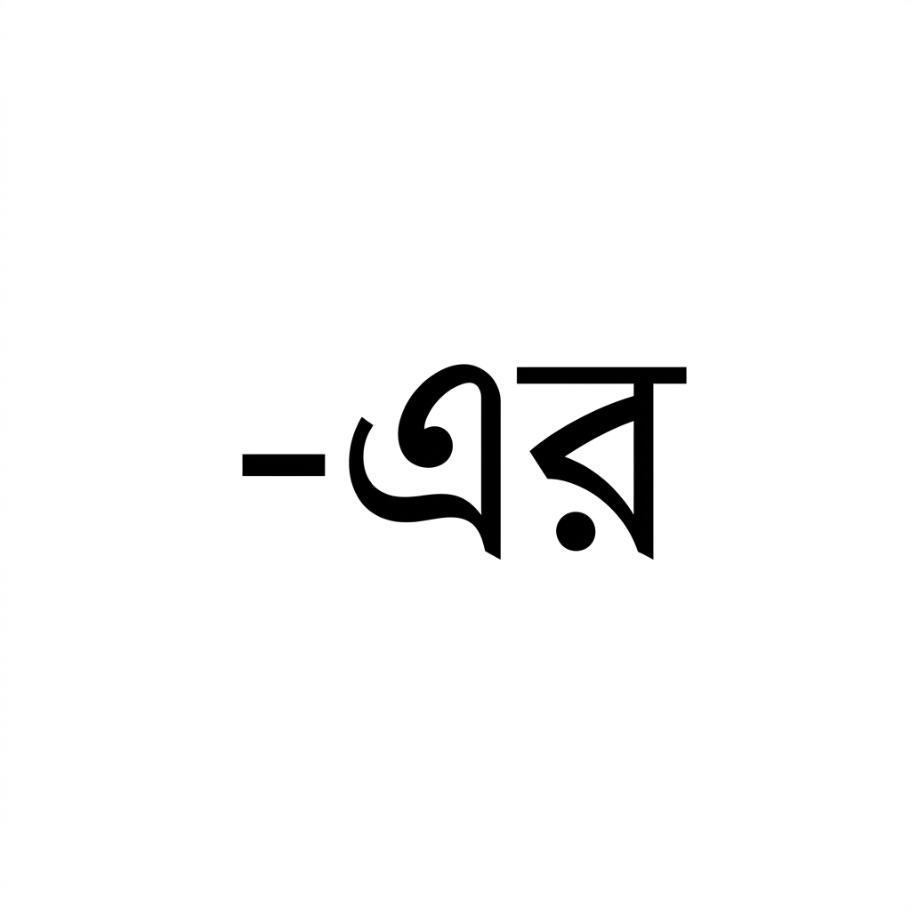
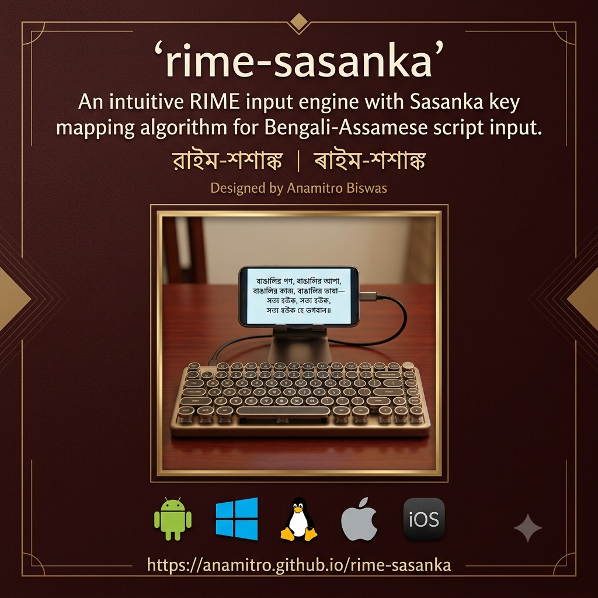

# rime-sasanka 

<head>
<link rel="preconnect" href="https://fonts.googleapis.com">
<link rel="preconnect" href="https://fonts.gstatic.com" crossorigin>
<link href="https://fonts.googleapis.com/css2?family=Noto+Serif+Bengali:wght@100..900&display=swap" rel="stylesheet">
</head>

## This page shows:
1. [Why you will love](#why) 
2. [How to set up](#installation)  [on your device](#installation)
   - [Android](#android)
   - [Windows](#windows)
   - [MacOS](#macos)
   - [iOS](#ios)
   - [Linux](#linux)
3. [How to get started with a comfortable typing experience](#typing-manual)
   - [Vowels](#vowels)
   - [Consonants and Conjuncts](#consonants) and [ZWNJ](zero-width-non-joiner)
   - [Commit text and Space](#space)
   - [Sanskrit](#sanskrit)
5. [And the author, who doesn't matter](#author)

## Why

- **Custom Phonetic Engine** Unicode Bengali input engine in RIME framework, with phonetic layout that prioritizes ease of typing.
- **Unique Transcription Rules** more intuitive experience than standard layouts.
- **Fixed layout** you may type without looking at the screen.
- **Minor conjunct-related grammatical corrections** inbuilt.
- **Minimized input key strings**, faster typing.
- **Open Source Accessibility** Developed by Anamitro Biswas, the project is hosted on GitHub to allow for community contributions and transparent development.  
- The only **platform independent** input method.
- **Works with wired/bluetooth remote keyboard, as well as UI.**

## Installation
Install [RIME](https://rime.im/download/) for your OS. Weasel for Windows etc. I do not recommend any. You'll find good options in the internet. See [this](https://www.mintimate.cc/en/guide/installRime.html).

Also, please download the  program from [the GitHub repository](https://github.com/anamitro/rime-sasanka/releases). Extract the .yaml files. After OS-specific setup, choose Sasanka as input method.

### Android
#### TRIME for Android
Install [TRIME](https://github.com/osfans/trime). Save the .yaml files to `/storage/emulated/0/rime`. Deploy.

#### Little Penguin for Android
See [these instructions](https://fcitx5-android.github.io/installation/)

### Windows
Save the .yaml files to C:\Users\Your_Username\AppData\Roaming\Rime

### MacOS
Save .yaml files in ~/Library/Rime/ directory on your Mac. Click "Deploy" in the Squirrel Rime menu bar icon.

### iOS
See [this page](https://blog.fernvenue.com/archives/configure-hamster-and-rime-on-ios/).

### Linux
Depending on which input method you use--
#### For IBus:
Create a custom yaml file using terminal commands like mkdir -p ~/.config/ibus/rime && nano ~/.config/ibus/rime/default.custom.yaml

A better similar option might be my [ibus-table-sasanka](https://anamitro.github.io/ibus-table-sasankadeva).
#### For Fcitx5:
Place your custom configuration files in ~/.local/share/fcitx5/rime/

## Typing Manual

### Vowels

|  |  |  |  |
| --- | --- | --- | --- |
| অ | আ | ই | ঈ |
| উ | ঊ | ঋ | ৠ |
| ঌ | ৡ | এ | ঐ |
| ও | ঔ |  |  |

| একক | স্বরবর্ণ |  |  |
| --- | --- | --- | --- |
| A | AA/aa | I | II |
| U | UU | R | R< |
| LLi | LLi} | E | AI |
| O | AU |  |  |

| স্বরবর্ণ | -কার |  |  |
| --- | --- | --- | --- |
|  | a | i | ii |
| u | uu | < | << |
| } | }} | e | ai |
| o | au |  |  |

### Consonants

|  |  |  |  |  |
| --- | --- | --- | --- | --- |
| ক | খ | গ | ঘ | ঙ |
| চ | ছ | জ | ঝ | ঞ |
| ট | ঠ | ড | ঢ | ণ |
| ত | থ | দ | ধ | ন |
| প | ফ | ব | ভ | ম |
| য | র, ৰ | ল | ব, ৱ | শ |
| ষ | স | হ | ড় | ঢ় |
| য় | ৎ | ং | ঃ | ঁ |

#### Stand-alone consonant with অ, first component of a conjunct

|  |  |  |  |  |
| --- | --- | --- | --- | --- |
| k | kh | g | gh | Ng |
| c | ch | j | jh | & |
| T | Th | D | Dh | N |
| t | th | d | dh | n |
| p | f | b | v/bh | m |
| z | r, = | l | b, B | S |
| Sh | s | h | q | Q |
| y | { | ` | H | ~ |

#### Following components of a conjunct

|  |  |  |  |  |
| --- | --- | --- | --- | --- |
| K | Kh | G | Gh |  |
| C | Ch | J | Jh |  |
| Z | Zh | X | Xh | [ |
| V | Vh | W | Wh | > |
| P | F | w | Bh | M |
| ] | / | L | w |  |
|  | \s |  |  |  |
|  |  |  |  |  |

All conjunct second components can also be typed as
> \ (consonant as first component)

#### First component of a conjunct

|  |  |  |  |  |
| --- | --- | --- | --- | --- |
|  |  |  |  | n |
|  |  |  |  | n |
|  |  |  |  |  |
|  |  |  |  |  |
|  |  |  |  |  |
|  | । |  |  |  |
|  |  |  |  |  |
|  |  |  |  |  |

### Space
One  commits the glyph sequence entered.

  commits the previous word and renders a blank space after.

### Sanskrit

| 𑁍 | ঽ | ৺ | ্ | ৰ |
| --- | --- | --- | --- | --- |
| # | hh | ^ | \ | = |

### Symbols

| ☸ | ₹ | $ | 🇮🇳 |
| --- | --- | --- | --- |
| @ | $ | $$ | ## |

### Zero Width Non Joiner
 _ (underscore)
 
 **Use:**
 
 | r\z | r_\z | d\z | d\\_z |
 | --- | --- | --- | --- |
 | র্য | ‍র‍্য | দ্য | দ্‌য |
 | । z | r] | | |
 

## Author
[Anamitro Biswas](https://anamitro.github.io)

**Email:** anamitroappu@gmail.com (feel free to get in touch if needed)

🇮🇳 Made in India

Named after King Sasankadeva of Gauda (Bengal) of the 7th century. The logo shows a Bengali "Śa", in GNU FreeSerif font.

Copyright (C) 2021-2026 Anamitro Biswas. Licensed under LGPL 2.1.
